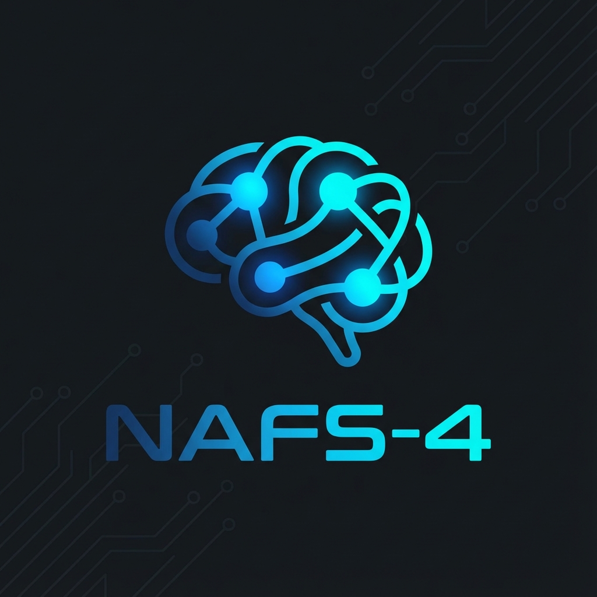

<p align="center">
  
</p>

<h1 align="center">NAFS-4: Neuromorphic AI Framework System</h1>

<p align="center">
A production-grade, self-evolving cognitive architecture framework implemented in Rust.<br/>
Build autonomous AI agents with fast perception, deliberate reasoning, meta-cognition, and self-evolution.
</p>

---

## Architecture

NAFS-4 implements a hierarchical cognitive model inspired by dual-process theory and meta-learning research:

```
+-----------------------------------------------------------+
|                       ORCHESTRATOR                        |
+---------------+---------------+---------------+-----------+
|   System 1    |   System 2    |   System 3    | System 4  |
|  Perception   |   Reasoning   |    Memory     | Evolution |
|    (Fast)     |   (ToT/CoT)   |  (Episodic)   | (Learning)|
+---------------+---------------+---------------+-----------+
                              |
              +---------------+----------------+
              |      Unified Memory Layer      |
              +---------------+----------------+
              |   Barq-DB     |  Barq-GraphDB  |
              |   (Vector)    |    (Graph)     |
              +---------------+----------------+
```

### System 1: Instinct and Perception
Provides fast, heuristic-based responses to environmental stimuli. It utilizes caching and pattern matching to handle routine tasks efficiently without invoking expensive reasoning resources.

### System 2: Deliberate Reasoning
Implements a Tree of Thought (ToT) reasoning engine. It performs symbolic verification, planning, and multi-step problem solving. This system engages when System 1 heuristics are insufficient or when high-stakes decisions require logical validation.

### System 3: Meta-Cognition and Memory
Maintains the agent's self-model (`identity`, `capabilities`, `values`) and manages a comprehensive memory system (episodic and semantic). It features an Executive Monitor that tracks internal state, motivation, and goal alignment.

### System 4: Evolution
A novel "Textual Backpropagation" mechanism allowing agents to improve over time. By analyzing failure patterns, System 4 generates textual gradients—instructions for self-modification—that selectively update the agent's prompt architecture and capabilities, subject to strict Kernel Supervisor constraints.

### Orchestrator
The central coordination layer that routes requests, manages agent lifecycles, and ensures seamless data flow between all cognitive systems.

---

## Key Features

- **Neuro-Symbolic Reasoning**: Combines Large Language Model (LLM) flexibility with symbolic logic verification.
- **Autonomous Self-Evolution**: Agents iteratively refine their own behavior based on operational outcomes.
- **Robust Persistence**: Distributed state management for long-running agent processes.
- **Kernel Safety**: Hard constraints prevent agents from evolving potentially unsafe behaviors.
- **High Performance**: Built on Rust's async runtime (Tokio) for concurrent agent execution.

---

## Supported LLM Providers

NAFS-4 includes native support for a wide range of LLM providers:

| Category | Providers |
|----------|-----------|
| **Major Platforms** | OpenAI, Anthropic (Claude), Google (Gemini), Azure OpenAI |
| **Specialized** | Cohere, Mistral AI, Together.ai, Groq, Fireworks AI |
| **Embedding-Focused** | Voyage AI, Jina AI |
| **Local/Private** | Ollama, LocalAI, HuggingFace, any OpenAI-compatible endpoint |

---

## Memory and Storage

NAFS-4 features a unified memory subsystem that abstracts vector and graph storage:

| Storage | Purpose | Integration |
|---------|---------|-------------|
| **Barq-DB** | Vector storage for high-dimensional similarity search | Native gRPC |
| **Barq-GraphDB** | Knowledge graph for complex relational memory | Native HTTP |
| **In-Memory** | Development and testing | Built-in |

---

## Python Bindings

For Python developers, NAFS-4 provides native bindings via PyO3.

**[View Python Documentation](nafs-python/README.md)**

Quick install:
```bash
pip install git+https://github.com/YASSERRMD/nafs-4.git#subdirectory=nafs-python
```

---

## Rust Installation

Ensure you have Rust and Cargo installed (1.70+).

```bash
git clone https://github.com/YASSERRMD/nafs-4.git
cd nafs-4
cargo build --release
```

---

## Usage

### Command Line Interface (CLI)

The `nafs` binary provides interactive management capabilities.

**Manage Agents**
```bash
# Create a new agent
nafs agent create --name "Analyst_01" --role "Data Analyst"

# List active agents
nafs agent list

# Query an agent directly
nafs agent query --agent-id "agent-uuid" --query "Analyze the provided dataset."
```

**System Operations**
```bash
# Check system health and metrics
nafs system health

# Start the interactive REPL
nafs repl
```

### REST API

The `nafs-server` service enables remote integration.

**Start the Server**
```bash
cargo run --release -p nafs-server
# Server listening on http://127.0.0.1:3000
```

**API Endpoints**

| Method | Endpoint | Description |
|--------|----------|-------------|
| `GET` | `/health` | System health status |
| `POST` | `/agents` | Inspect/Create new agent instances |
| `POST` | `/agents/:id/query` | Submit a cognitive task to an agent |
| `GET` | `/agents/:id/memory` | Retrieve agent memory context |
| `POST` | `/agents/:id/evolve` | Trigger an evolution cycle manually |

---

## Development and Testing

The repository includes a comprehensive test suite covering unit logic and end-to-end integration.

```bash
# Run all unit tests
cargo test --workspace

# Run integration pipeline tests
cargo test -p nafs-integration
```

---

## Project Structure

| Crate | Description |
|-------|-------------|
| `nafs-core` | Fundamental types and traits |
| `nafs-system1` | Perception and heuristic modules |
| `nafs-system2` | Reasoning engines and symbolic verification |
| `nafs-system3` | Memory systems and meta-cognitive monitors |
| `nafs-system4` | Evolutionary algorithms and safety kernels |
| `nafs-orchestrator` | Lifecycle management and event routing |
| `nafs-llm` | LLM provider integrations |
| `nafs-memory` | Vector and graph storage providers |
| `nafs-tools` | Agent tooling capabilities |
| `nafs-cli` | Terminal user interface implementation |
| `nafs-server` | HTTP/WebSocket API implementation |
| `nafs-python` | Python bindings (PyO3) |

---

## License

This project is licensed under the MIT License - see the [LICENSE](LICENSE) file for details.
